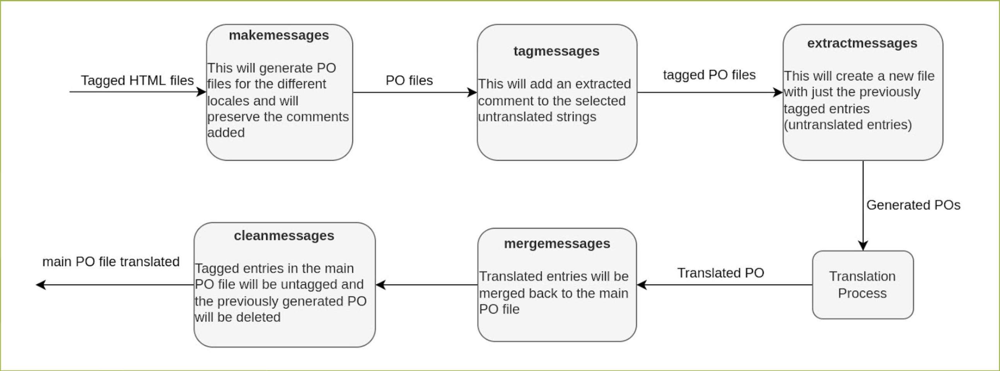

# Better managing i18n and PO files in Django

This is a proposed workflow to better manage huge PO files in Django apps by using the [polib](link-to-polib)
library, and is mainly intended for the management of PO files that are produced when translating static
pages (one PO file contains all the strings of the templates that are in the [app](django-app)),
Anyway, these concepts could be applied in other scenarios or other frameworks. If you have giant PO
files and you don't know how to deal with them probably this is what you're looking for.

We assume you're familiar with the basic concepts around PO files and their structure.
If not, you can look at the [official documentation](po-documentation). We assume that
you have at least a little experience around i18n in Django, as well.

## A little of the history

Some time ago, with my team, we were internationalizing our client's website. In the beginning, everything
was pretty simple and straightforward, we had one [locale](what-is-a-locale) and we were translating just
a couple of pages, so our PO files were small enough and we were able to handle them easily.

A couple of months went by, and we had three locales and way more pages that we were translating, so
the problem started to be noticeable. We were sending these giant PO files (one per locale and app),
around ~30k lines, over and over again for translation. Translators started to complain that they were not
able to identify what strings needed translation and which didn't, or at least not in an easy way. So,
after some thinking and learning about what PO files really are, we came up with this workflow.
The main idea behind it is to break up giant PO files into smaller, more manageable, that just
contains `untranslated` entries into a new (temporal) PO.

## The mighty workflow

Before into details, let's see what we get from using this workflow:
* PO files sent to translation contain just relevant entries (entries that need translation).
* Parallel translation projects, since we won't be sending repeated entries in any of them, avoiding
merge conflicts.
* Translators can focus on translations and they know that all entries contained in the PO file need
attention

This workflow relies on the [extracted comments](po-documentation) concept that allows developers to
add comments in a programmatic way. This decision was a little tricky since we were thinking of using
`translator comments` but we're developers, not translators, and `extracted comments` were a better fit
in our opinion, this could lead to a whole new debate, but for now, we will stick to `extracted comments`
and that's what you need to know.

So what are `extracted comments`?

> Comment lines starting with `#.` contain comments given by the programmer, directed at the translator;
> These comments are called extracted comments because the `xgettext` program extracts them from the program’s
> source code.

As you can see, these are messages that developers aim to translators. In this specific case,
we will use `extracted comments` to let translators know that a specific `PO Entry` belongs to
a given `project`. For example, an `untranslated` entry with an extracted comment will look like this:

```python
#. project=unstranslated_entries
#: app1/templates/index.html:1
msgid "Lorem ipsum"
msgstr ""
```
Due to the decision to use `extracted comments`, the `makemessages` Django command had to be monkey patched.
Django pulls `extracted comments` from the code base, but in this case, we're introducing them programmatically
using the `polib`, so we needed to keep these comments even if they're not in the code base.

`Untranslated` is quoted since this definition could change from project to project.
In this case, our definition of `untranslated` is the following:
* An entry that has `msgstr` empty and does not have an extracted comment that contains the `project` string.
* An entry that contains the `fuzzy` flag.

So, `extracted comments are added to the PO entries that match these criteria.

The whole workflow looks like this:


Now, instead of two CLI commands (`makemessages` and `compilemessages`) we will have six commands,
each is detailed below:

* `makemessages`: this is the same command as the one in the Django code base, it will accept all the
parameters that are accepted in the original one, and will accept one additional `--allow-obsolete`.
We identified that Django `makemessages` keep PO entries that are no longer used (e.g. From templates
that have been deleted), so we decided to not keep those by default, and give the user the option to
delete or keep them by using this flag. Usage: `python manage.py makemessages -l de`.

* `tagmessages`: this management command is the first step to creating an independent PO file that can be
sent for parallel translation. When run, this command will add a project name to entries that need
translation, as in the example above. Usage: `python manage.py tagmessages -l de -p jdoe_20220101`.
You could also tag entries for a single template by using the `--file-name` param. When in use,
this command will only tag the entries that are contained in the given path. Usage:
`python manage.py tagmessages -l de -p jdoe_20220101 -f app1/templates/index.html`.

* `extractmessages`: this command will take the previously tagged entries and will create a temporal PO
file with them. The output of this command is the file you will be using and sending for translation.
Usage: `python manage.py extractmessages -l de -p jdoe_20220101`

* `mergemessages`: After our translation process has been executed we need a way to put those entries
back in our main PO file. This action will allow us to merge back the already translated entries. In this
case, the usage is a little bit trickier and has a couple of more parameters. The relative path to the PO
that we want to merge back needs to be provided.
Usage: `python manage.py mergemessages -a app1 -l de -p jdoe_20220101 path/to/translated/PO/file`.

* `cleanmessages`: finally, we need a way to delete the `extracted comments` added for the project and
also the temporary file created in `extractmessages` step. The `cleanmessages` command allows us to do
both things. Usage: `python manage.py cleanmessages -l de -p jdoe_20220101`

* The `compilemessages` command will need to be run exactly as it is in the original workflow. One last
caveat, whether or not you want to add the temporary PO files to your version control is up to you, just
make sure you run the `cleanmessages` command to delete no longer necessary files.


[po-documentation]: https://www.gnu.org/software/gettext/manual/html_node/PO-Files.html
[link-to-polib]: https://polib.readthedocs.io/en/latest/
[django-app]: https://docs.djangoproject.com/en/4.1/ref/applications/
[what-is-a-locale]:()
